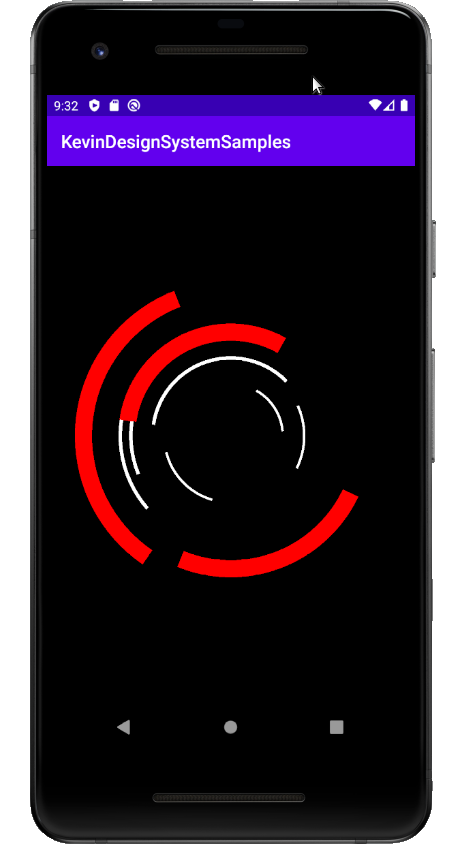

# KevinDesignSystem
Attempt at creating a personal UI design system library in Android

# How to Add it to your Project
I've used Jitpack for adding this to my projects.  To add this first make sure jitpack is one of your repositories in your root build.gradle:

Add this to the repositories section:

```
maven { url 'https://jitpack.io' }
```

Next add the actual dependency itself.  In your module build.gradle add this under dependencies:

```
implementation 'com.github.kevinvandenbreemen:KevinDesignSystem:[release_num]'
```

# Styling

## Margins
Whenever possible set your margin values to *@dimen/margin*, as this will cause your layout to use the design system's default margin value.

## Sections
Content should be broken up into discrete sections whenever possible.  The following background styles should be applied to most ViewGroups:

### @drawable/kds_section_background
This is the most common style.

### @drawable/kds_attention_background
Provides a blue border that contrasts with the gray border of the default section background above.

### @drawable/kds_alert_background
Use this for providing critical / show-stopping information to your user.

# Components

## Buttons

Use the styles to create buttons in the design system.  The following button styles are available:

### kds_default_button

Use this for most calls to action that involve buttons.  This can represent both a destructive and a non-destructive button.

Example:


# Activities

## Important
In the onCreate() method for any activity you override be sure to call setContentView() first before calling super.onCreate().  This will give the superclass a chance to set up the UI components.

## KDSSystemActivity



### How to use It
Add an activity to your project and have it inherit from KDSSystemActivity.

Make sure your activity supports device rotation so be sure to include

```
android:configChanges="orientation"
```

in the activity declaration in AndroidManifest.xml

### How to Add Content
You can add your own content by adding views into the 'mainContent' view.